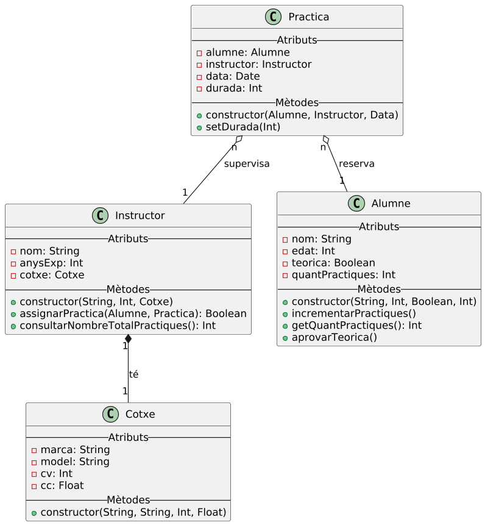

# Info:
Exemple de programa per desktop fet amb Kotlin usant Programació Orientada a Objectes i amb el seu Diagrama de Classes UML.

# Diagrama de Classes

> [!NOTE]
> Diagrama de Classes fet amb [PlantUML](https://plantuml.com/class-diagram)
